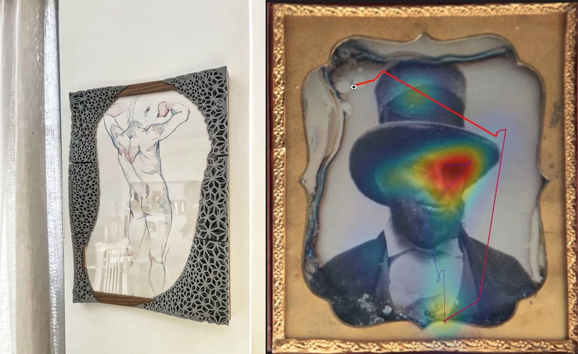
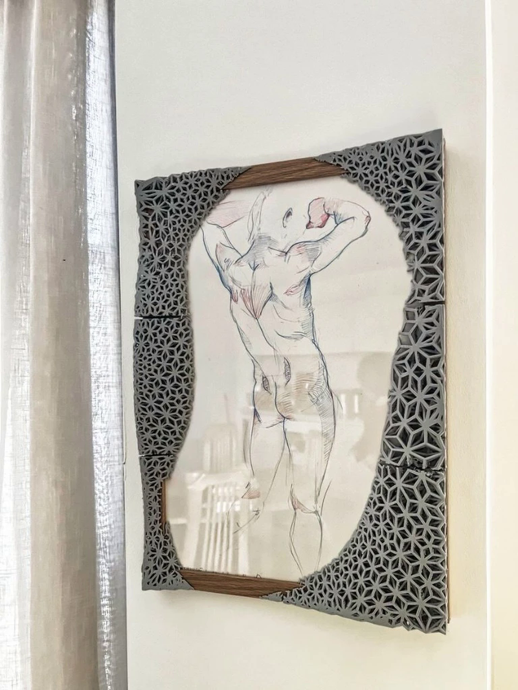
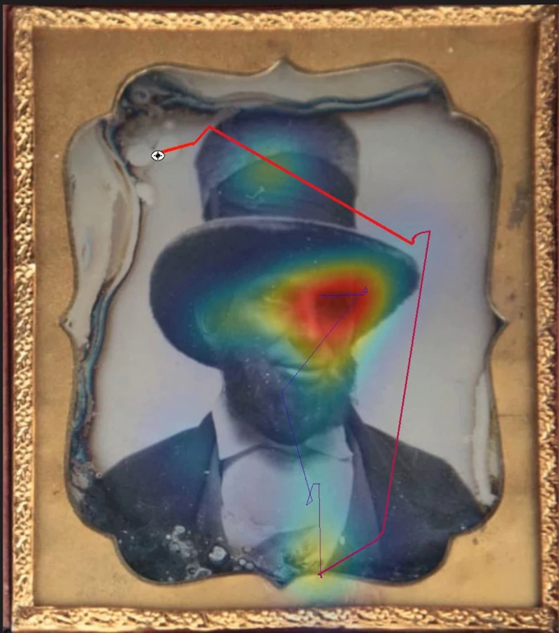
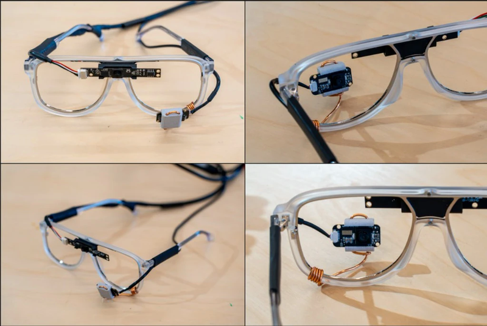
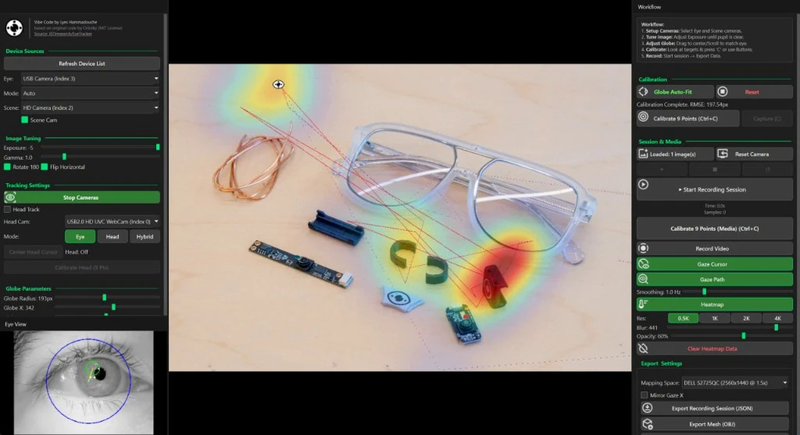

<p align="center">
  
</p>

<h1 align="center">EyeTrackerFrames</h1>

<p align="center">
  <strong>Under-$50 open-source eye tracker for art & research</strong><br>
  Real-time pupil detection · 3D gaze vectors · Heatmap visualization · Head tracking
</p>

<p align="center">
  
  
  
</p>

---

## Eye Tracking Meets Art

<table>
  <tr>
    <td width="50%" align="center">
      
    </td>
    <td width="50%" align="center">
      
    </td>
  </tr>
  <tr>
    <td align="center"><b>Tessellated 3D-Printed Frames</b><br>Algorithmic frame design driven by gaze data</td>
    <td align="center"><b>Heatmap Visualization</b><br>Gaze paths and fixation density on historical portraits</td>
  </tr>
</table>

This project explores the intersection of eye tracking technology and artistic practice. Using inexpensive, open-source hardware, it captures gaze data from viewers and transforms it into visual artifacts: heatmaps overlaid on artwork, 3D-printed frames shaped by tessellation algorithms, and gaze-driven compositional studies.

---

## Hardware & Software

<table>
  <tr>
    <td width="50%" align="center">
      
    </td>
    <td width="50%" align="center">
      
    </td>
  </tr>
  <tr>
    <td align="center"><b>DIY IR Glasses</b><br>Under $50 in parts — IR cameras, custom LEDs, scene camera</td>
    <td align="center"><b>Real-Time Interface</b><br>Pupil detection, gaze vectors, and 3D head tracking</td>
  </tr>
</table>

---

## Modules

| Module | Description | Hardware |
|--------|-------------|----------|
| **OrloskyPupilDetector** | Core pupil detection from IR eye camera video or live feed | IR eye camera |
| **OrloskyPupilDetectorLite** | Faster, lighter pupil detection (requires good lighting) | IR eye camera |
| **3DTracker** | 3D gaze vector + OpenGL sphere rendering | Near-eye IR camera |
| **FrontCameraTracker** | Front-facing camera eye tracking with gaze-to-screen projection | Webcam + IR camera |
| **HeadTracker** | Head pose estimation, mouse cursor control via head movement | Webcam |
| **Webcam3DTracker** | 3D gaze from a single webcam, virtual monitor calibration | Webcam |

---

## Quick Start

### Requirements

- Python 3.8+
- OpenCV (`opencv-python`)
- NumPy (**< 2.0** — see note below)
- Tkinter (included with most Python distributions)

### Install

```bash
pip install opencv-python numpy
```

> **NumPy note:** There is a known issue with NumPy 2.0.0. Use `pip install numpy==1.26.0` if you encounter errors.

### Run Pupil Detector

```bash
python OrloskyPupilDetector.py
```

If the hardcoded video path is not found, a file browser will open. A test video (`eye_test.mp4`) is included.

### Run 3D Tracker

```bash
cd 3DTracker
pip install PyOpenGL PyQt5  # optional, for 3D visualization
python Orlosky3DEyeTracker.py
```

### Run Head Tracker

```bash
cd HeadTracker
pip install mediapipe pyautogui keyboard
python MonitorTracking.py
```

### Run Webcam 3D Tracker

```bash
cd Webcam3DTracker
pip install mediapipe pyautogui keyboard scipy
python MonitorTracking.py
```

See individual module READMEs for detailed usage.

---

## Hardware Build

### IR Eye Camera (for pupil detection modules)

| Option | Cost | Notes |
|--------|------|-------|
| DIY IR camera with custom LEDs | < $100 | [Build tutorial](https://www.youtube.com/watch?v=8lZqCMRMtC8) |
| GC0308 IR Camera | ~ $17 | [Amazon](https://amzn.to/41x8p2W) — requires some modification |
| Spinel Camera | ~ $100 | [Amazon](https://amzn.to/3D8faQB) |
| USB Extension cables (x2) | ~ $8 | [Amazon](https://amzn.to/4knyf1N) |

### Webcam (for head/webcam trackers)

Any standard webcam works. Tested with: [recommended webcam ($35)](https://amzn.to/43of401).

---

## Input Assumptions

- **Resolution:** Works best with 640×480 video. Non-4:3 inputs are auto-cropped.
- **Pupil detection:** The image must show the entire eye. Dark corners (e.g. VR lens borders) should be cropped.
- **Lighting:** The Lite version requires adequate, even lighting.

---

## Project Structure

```
EyeTrackerFrames/
├── OrloskyPupilDetector.py            # Full pupil detection
├── OrloskyPupilDetectorLite.py        # Lightweight pupil detection
├── OrloskyPupilDetectorRaspberryPi.py # Raspberry Pi optimized
├── eye_test.mp4                       # Test video
├── 3DTracker/                         # 3D gaze + OpenGL sphere
│   ├── Orlosky3DEyeTracker.py
│   ├── gl_sphere.py                  # OpenGL visualization
│   └── GazeFollower.cs               # Unity integration
├── FrontCameraTracker/                # Front camera gaze projection
│   └── Orlosky3DEyeTrackerFrontCamera.py
├── HeadTracker/                       # Head pose → mouse control
│   ├── MonitorTracking.py
│   └── CursorCircle.py               # Visual cursor overlay
└── Webcam3DTracker/                   # Single webcam 3D tracking
    └── MonitorTracking.py
```

---

## Algorithm

The pupil detection algorithm is an updated and simplified version of the pupil fitter from [YutaItoh/3D-Eye-Tracker](https://github.com/YutaItoh/3D-Eye-Tracker/blob/master/main/pupilFitter.h).

Pipeline:
1. **Locate darkest region** — sparse sampling finds the pupil candidate
2. **Threshold & mask** — binary threshold isolates dark regions around the candidate
3. **Contour filtering** — largest reasonable contour is selected (area + aspect ratio)
4. **Ellipse fitting** — `cv2.fitEllipse()` returns the pupil ellipse

Algorithm walkthrough: [youtube.com/watch?v=bL92JUBG8xw](https://www.youtube.com/watch?v=bL92JUBG8xw)

---

## Demo Videos

| Demo | Link |
|------|------|
| Pupil detection on test video | [youtu.be/B06cUMplDHw](https://youtu.be/B06cUMplDHw) |
| 3D tracker with DIY glasses | [youtu.be/zuoOvywtwtA](https://youtu.be/zuoOvywtwtA) |
| Head tracking mouse control | [youtu.be/hImmJDTgXjw](https://youtu.be/hImmJDTgXjw) |
| DIY IR camera build guide | [youtu.be/8lZqCMRMtC8](https://www.youtube.com/watch?v=8lZqCMRMtC8) |

---

## Credits

- Original pupil tracking algorithm: [Yuta Itoh — 3D-Eye-Tracker](https://github.com/YutaItoh/3D-Eye-Tracker)
- Original project: [JEOresearch/EyeTracker](https://github.com/JEOresearch/EyeTracker)
- Head tracking: [MediaPipe Face Mesh](https://google.github.io/mediapipe/solutions/face_mesh.html)

---

## License

This project is licensed under the [MIT License](LICENSE).

---

<p align="center">
  <sub>Built for art & research. Open-source, accessible, under $50.</sub>
</p>
